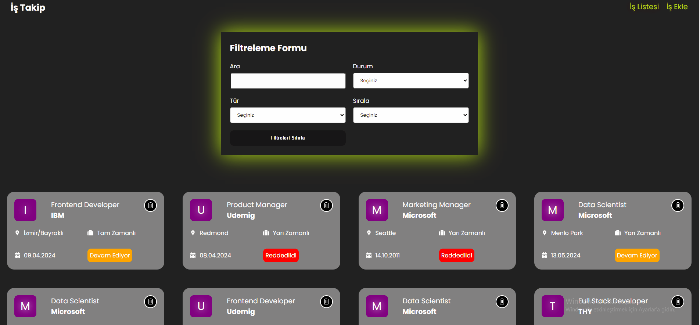

## Job App Projesi

Bu proje kullanıcıların işleri filtreleyip listeleme yapmasını amaçlanmaktadır. İş ekleme, iş durumunu takip etme, iş durumuna vev türüne göre filtreleme yapma ve iş silme işlemleri yapılabilmektedir. Kullanıcı dostu arayüzü ile her ekrana uygun olacak şekilde tasarlanmıştır.

## Kullanılan Kütüphaneler

-@reduxjs/toolkit
-axios
-json-server
-react
-react-dom
-react-icon
-react-icons
-react-redux
-react-router-dom
-react-toastify
-sass
-uuid

## GIF

